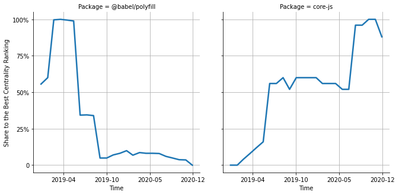

# [`isomorphic-fetch`](https://www.npmjs.com/package/@babel/polyfill) -> [`core-js`](https://www.npmjs.com/package/core-js)

The following figure compares the over time centrality ranking of [`@babel/polyfill`](https://www.npmjs.com/package/@babel/polyfill) and [`core-js`](https://www.npmjs.com/package/core-js).

## Pull request examples

The following are examples of pull requests that perform a dependency migration from [`@babel/polyfill`](https://www.npmjs.com/package/@babel/polyfill) to [`core-js`](https://www.npmjs.com/package/core-js):

- [tracespace/tracespace#183](https://github.com/tracespace/tracespace/pull/183)
- [aragon/aragon-cli#622](https://github.com/aragon/aragon-cli/pull/622)
- [untool/untool#415](https://github.com/untool/untool/pull/415)
- [apache-superset/superset-ui#298](https://github.com/apache-superset/superset-ui/pull/298)

## What is package centrality?

By definition, centrality is a measure of the prominence or importance of a node in a social network.
In our context, the centrality allows us to rank the packages based on the popularity/importance of packages that depend on them.
Specifically, we use the PageRank algorithm to evaluate the shift in their centrality over time.
For more details read our research paper: [Towards Using Package Centrality Trend to Identify Packages in Decline](https://arxiv.org/abs/2107.10168).
