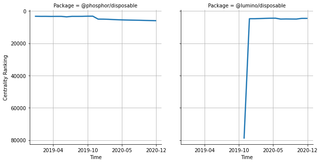

# [`isomorphic-fetch`](https://www.npmjs.com/package/@phosphor/disposable) -> [`@lumino/disposable`](https://www.npmjs.com/package/@lumino/disposable)

The following figure compares the over time centrality ranking of [`@phosphor/disposable`](https://www.npmjs.com/package/@phosphor/disposable) and [`@lumino/disposable`](https://www.npmjs.com/package/@lumino/disposable).

## A pull request example

The following is an example of a pull request that perform a dependency migration from [`@phosphor/disposable`](https://www.npmjs.com/package/@phosphor/disposable) to [`@lumino/disposable`](https://www.npmjs.com/package/@lumino/disposable):

- [gibiansky/IHaskell#1151](https://github.com/gibiansky/IHaskell/pull/1151)

## What is package centrality?

By definition, centrality is a measure of the prominence or importance of a node in a social network.
In our context, the centrality allows us to rank the packages based on the popularity/importance of packages that depend on them.
Specifically, we use the PageRank algorithm to evaluate the shift in their centrality over time.
For more details read our research paper: [Towards Using Package Centrality Trend to Identify Packages in Decline](https://arxiv.org/abs/2107.10168).
