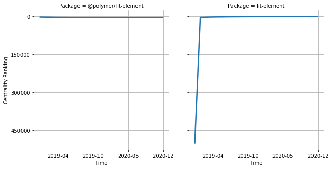

# [`@polymer/lit-element`](https://www.npmjs.com/package/@polymer/lit-element) -> [`lit-element`](https://www.npmjs.com/package/lit-element)

The following figure compares the over time centrality ranking of [`@polymer/lit-element`](https://www.npmjs.com/package/@polymer/lit-element) and [`lit-element`](https://www.npmjs.com/package/lit-element).

## Pull request examples

The following are examples of pull requests that perform a dependency migration from [`@polymer/lit-element`](https://www.npmjs.com/package/@polymer/lit-element) to [`lit-element`](https://www.npmjs.com/package/lit-element):

- [material-components/material-components-web-components#184](https://github.com/material-components/material-components-web-components/pull/184)
- [wiredjs/wired-elements#88](https://github.com/wiredjs/wired-elements/pull/88)
- [bolt-design-system/bolt#1182](https://github.com/bolt-design-system/bolt/pull/1182)

## What is package centrality?

By definition, centrality is a measure of the prominence or importance of a node in a social network.
In our context, the centrality allows us to rank the packages based on the popularity/importance of packages that depend on them.
Specifically, we use the PageRank algorithm to evaluate the shift in their centrality over time.
For more details read our research paper: [Towards Using Package Centrality Trend to Identify Packages in Decline](https://arxiv.org/abs/2107.10168).
