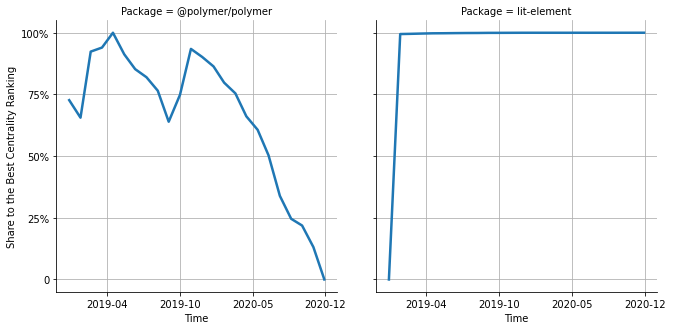

# [`isomorphic-fetch`](https://www.npmjs.com/package/@polymer/polymer) -> [`lit-element`](https://www.npmjs.com/package/lit-element)

The following figure compares the over time centrality ranking of [`@polymer/polymer`](https://www.npmjs.com/package/@polymer/polymer) and [`lit-element`](https://www.npmjs.com/package/lit-element).

## A pull request example

The following is an example of a pull request that perform a dependency migration from [`@polymer/polymer`](https://www.npmjs.com/package/@polymer/polymer) to [`lit-element`](https://www.npmjs.com/package/lit-element):

- [elmsln/lrnwebcomponents#352](https://github.com/elmsln/lrnwebcomponents/pull/352)

## What is package centrality?

By definition, centrality is a measure of the prominence or importance of a node in a social network.
In our context, the centrality allows us to rank the packages based on the popularity/importance of packages that depend on them.
Specifically, we use the PageRank algorithm to evaluate the shift in their centrality over time.
For more details read our research paper: [Towards Using Package Centrality Trend to Identify Packages in Decline](https://arxiv.org/abs/2107.10168).
