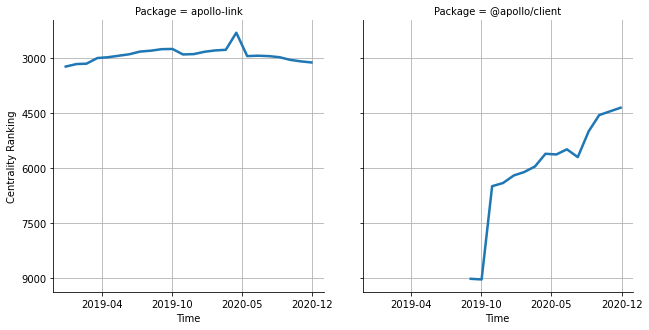

# [`isomorphic-fetch`](https://www.npmjs.com/package/apollo-link) -> [`@apollo/client`](https://www.npmjs.com/package/@apollo/client)

The following figure compares the over time centrality ranking of [`apollo-link`](https://www.npmjs.com/package/apollo-link) and [`@apollo/client`](https://www.npmjs.com/package/@apollo/client).

## A pull request example

The following is an example of a pull request that perform a dependency migration from [`apollo-link`](https://www.npmjs.com/package/apollo-link) to [`@apollo/client`](https://www.npmjs.com/package/@apollo/client):

- [awslabs/aws-mobile-appsync-sdk-js#561](https://github.com/awslabs/aws-mobile-appsync-sdk-js/pull/561)

## What is package centrality?

By definition, centrality is a measure of the prominence or importance of a node in a social network.
In our context, the centrality allows us to rank the packages based on the popularity/importance of packages that depend on them.
Specifically, we use the PageRank algorithm to evaluate the shift in their centrality over time.
For more details read our research paper: [Towards Using Package Centrality Trend to Identify Packages in Decline](https://arxiv.org/abs/2107.10168).
