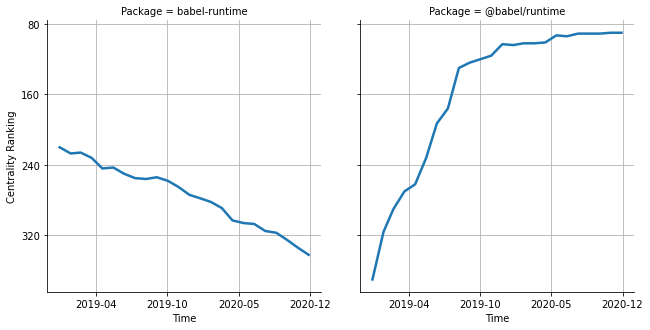

# [`isomorphic-fetch`](https://www.npmjs.com/package/babel-runtime) -> [`@babel/runtime`](https://www.npmjs.com/package/@babel/runtime)

The following figure compares the over time centrality ranking of [`babel-runtime`](https://www.npmjs.com/package/babel-runtime) and [`@babel/runtime`](https://www.npmjs.com/package/@babel/runtime).

## Pull request examples

The following are examples of pull requests that perform a dependency migration from [`babel-runtime`](https://www.npmjs.com/package/babel-runtime) to [`@babel/runtime`](https://www.npmjs.com/package/@babel/runtime):

- [callemall/material-ui#11298](https://github.com/callemall/material-ui/pull/11298)
- [polkadot-js/common#126](https://github.com/polkadot-js/common/pull/126)
- [polkadot-js/api#90](https://github.com/polkadot-js/api/pull/90)
- [gatsbyjs/gatsby#5085](https://github.com/gatsbyjs/gatsby/pull/5085)
- [gatsbyjs/gatsby#5892](https://github.com/gatsbyjs/gatsby/pull/5892)

## What is package centrality?

By definition, centrality is a measure of the prominence or importance of a node in a social network.
In our context, the centrality allows us to rank the packages based on the popularity/importance of packages that depend on them.
Specifically, we use the PageRank algorithm to evaluate the shift in their centrality over time.
For more details read our research paper: [Towards Using Package Centrality Trend to Identify Packages in Decline](https://arxiv.org/abs/2107.10168).
