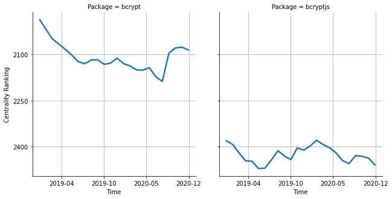

# [`bcrypt`](https://www.npmjs.com/package/bcrypt) -> [`bcryptjs`](https://www.npmjs.com/package/bcryptjs)

The following figure compares the over time centrality ranking of [`bcrypt`](https://www.npmjs.com/package/bcrypt) and [`bcryptjs`](https://www.npmjs.com/package/bcryptjs).

## A pull request example

The following is an example of a pull request that perform a dependency migration from [`bcrypt`](https://www.npmjs.com/package/bcrypt) to [`bcryptjs`](https://www.npmjs.com/package/bcryptjs):

- [keystonejs/keystone#2523](https://github.com/keystonejs/keystone/pull/2523)

## What is package centrality?

By definition, centrality is a measure of the prominence or importance of a node in a social network.
In our context, the centrality allows us to rank the packages based on the popularity/importance of packages that depend on them.
Specifically, we use the PageRank algorithm to evaluate the shift in their centrality over time.
For more details read our research paper: [Towards Using Package Centrality Trend to Identify Packages in Decline](https://arxiv.org/abs/2107.10168).
