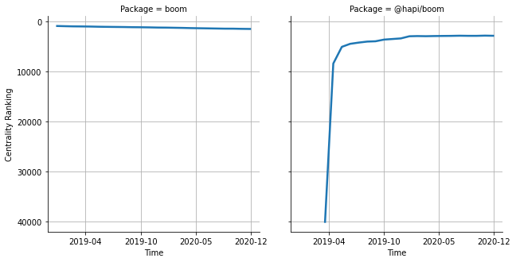

# [`boom`](https://www.npmjs.com/package/boom) -> [`@hapi/boom`](https://www.npmjs.com/package/@hapi/boom)

The following figure compares the over time centrality ranking of [`boom`](https://www.npmjs.com/package/boom) and [`@hapi/boom`](https://www.npmjs.com/package/@hapi/boom).

## A pull request example

The following is an example of a pull request that perform a dependency migration from [`boom`](https://www.npmjs.com/package/boom) to [`@hapi/boom`](https://www.npmjs.com/package/@hapi/boom):

- [electrode-io/electrode#1379](https://github.com/electrode-io/electrode/pull/1379)

## What is package centrality?

By definition, centrality is a measure of the prominence or importance of a node in a social network.
In our context, the centrality allows us to rank the packages based on the popularity/importance of packages that depend on them.
Specifically, we use the PageRank algorithm to evaluate the shift in their centrality over time.
For more details read our research paper: [Towards Using Package Centrality Trend to Identify Packages in Decline](https://arxiv.org/abs/2107.10168).
