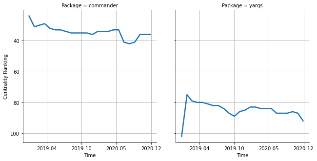

# [`isomorphic-fetch`](https://www.npmjs.com/package/commander) -> [`yargs`](https://www.npmjs.com/package/yargs)

The following figure compares the over time centrality ranking of [`commander`](https://www.npmjs.com/package/commander) and [`yargs`](https://www.npmjs.com/package/yargs).

## Pull request examples

The following are examples of pull requests that perform a dependency migration from [`commander`](https://www.npmjs.com/package/commander) to [`yargs`](https://www.npmjs.com/package/yargs):

- [tuateam/tua-mp#59](https://github.com/tuateam/tua-mp/pull/59)
- [mjmlio/mjml#1946](https://github.com/mjmlio/mjml/pull/1946)

## What is package centrality?

By definition, centrality is a measure of the prominence or importance of a node in a social network.
In our context, the centrality allows us to rank the packages based on the popularity/importance of packages that depend on them.
Specifically, we use the PageRank algorithm to evaluate the shift in their centrality over time.
For more details read our research paper: [Towards Using Package Centrality Trend to Identify Packages in Decline](https://arxiv.org/abs/2107.10168).
