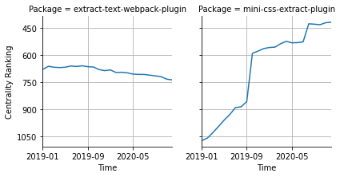

# [`isomorphic-fetch`](https://www.npmjs.com/package/extract-text-webpack-plugin) -> [`mini-css-extract-plugin`](https://www.npmjs.com/package/mini-css-extract-plugin)

The following figure compares the over time centrality ranking of [`extract-text-webpack-plugin`](https://www.npmjs.com/package/extract-text-webpack-plugin) and [`mini-css-extract-plugin`](https://www.npmjs.com/package/mini-css-extract-plugin).

## Pull request examples

The following are examples of pull requests that perform a dependency migration from [`extract-text-webpack-plugin`](https://www.npmjs.com/package/extract-text-webpack-plugin) to [`mini-css-extract-plugin`](https://www.npmjs.com/package/mini-css-extract-plugin):

- [bolt-design-system/bolt#544](https://github.com/bolt-design-system/bolt/pull/544)
- [xing/hops#441](https://github.com/xing/hops/pull/441)
- [xing/hops#444](https://github.com/xing/hops/pull/444)
- [opencomponents/base-templates#312](https://github.com/opencomponents/base-templates/pull/312)
- [opencomponents/oc-template-react#233](https://github.com/opencomponents/oc-template-react/pull/233)

## What is package centrality?

By definition, centrality is a measure of the prominence or importance of a node in a social network.
In our context, the centrality allows us to rank the packages based on the popularity/importance of packages that depend on them.
Specifically, we use the PageRank algorithm to evaluate the shift in their centrality over time.
For more details read our research paper: [Towards Using Package Centrality Trend to Identify Packages in Decline](https://arxiv.org/abs/2107.10168).
