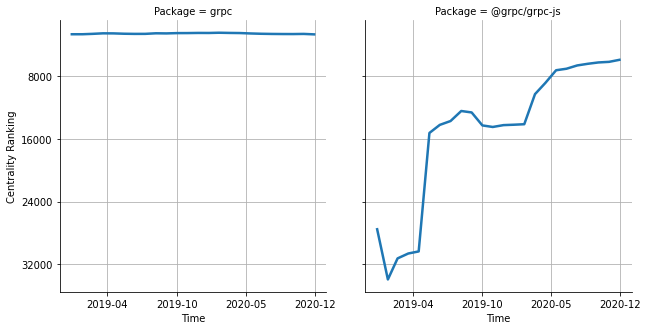

# [`isomorphic-fetch`](https://www.npmjs.com/package/grpc) -> [`@grpc/grpc-js`](https://www.npmjs.com/package/@grpc/grpc-js)

The following figure compares the over time centrality ranking of [`grpc`](https://www.npmjs.com/package/grpc) and [`@grpc/grpc-js`](https://www.npmjs.com/package/@grpc/grpc-js).

## Pull request examples

The following are examples of pull requests that perform a dependency migration from [`grpc`](https://www.npmjs.com/package/grpc) to [`@grpc/grpc-js`](https://www.npmjs.com/package/@grpc/grpc-js):

- [firebase/firebase-js-sdk#1804](https://github.com/firebase/firebase-js-sdk/pull/1804)
- [pulumi/pulumi#3728](https://github.com/pulumi/pulumi/pull/3728)
- [firebase/firebase-js-sdk#2856](https://github.com/firebase/firebase-js-sdk/pull/2856)
- [pulumi/pulumi-policy#235](https://github.com/pulumi/pulumi-policy/pull/235)
- [googleforgames/agones#1529](https://github.com/googleforgames/agones/pull/1529)

## What is package centrality?

By definition, centrality is a measure of the prominence or importance of a node in a social network.
In our context, the centrality allows us to rank the packages based on the popularity/importance of packages that depend on them.
Specifically, we use the PageRank algorithm to evaluate the shift in their centrality over time.
For more details read our research paper: [Towards Using Package Centrality Trend to Identify Packages in Decline](https://arxiv.org/abs/2107.10168).
