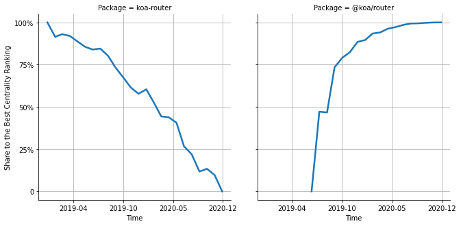

# [`isomorphic-fetch`](https://www.npmjs.com/package/koa-router) -> [`@koa/router`](https://www.npmjs.com/package/@koa/router)

The following figure compares the over time centrality ranking of [`koa-router`](https://www.npmjs.com/package/koa-router) and [`@koa/router`](https://www.npmjs.com/package/@koa/router).

## Pull request examples

The following are examples of pull requests that perform a dependency migration from [`koa-router`](https://www.npmjs.com/package/koa-router) to [`@koa/router`](https://www.npmjs.com/package/@koa/router):

- [mikojs/core#538](https://github.com/mikojs/core/pull/538)
- [imolorhe/altair#1257](https://github.com/imolorhe/altair/pull/1257)

## What is package centrality?

By definition, centrality is a measure of the prominence or importance of a node in a social network.
In our context, the centrality allows us to rank the packages based on the popularity/importance of packages that depend on them.
Specifically, we use the PageRank algorithm to evaluate the shift in their centrality over time.
For more details read our research paper: [Towards Using Package Centrality Trend to Identify Packages in Decline](https://arxiv.org/abs/2107.10168).
