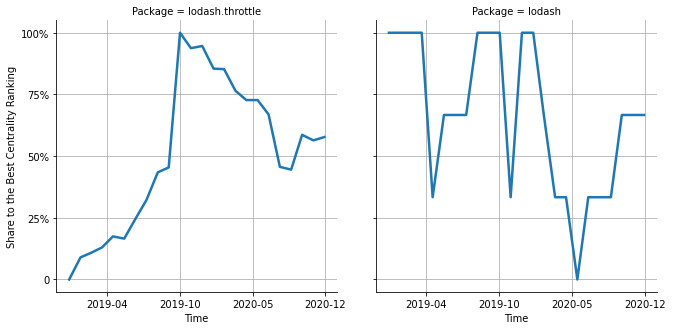

# [`isomorphic-fetch`](https://www.npmjs.com/package/lodash.throttle) -> [`lodash`](https://www.npmjs.com/package/lodash)

The following figure compares the over time centrality ranking of [`lodash.throttle`](https://www.npmjs.com/package/lodash.throttle) and [`lodash`](https://www.npmjs.com/package/lodash).

## A pull request example

The following is an example of a pull request that perform a dependency migration from [`lodash.throttle`](https://www.npmjs.com/package/lodash.throttle) to [`lodash`](https://www.npmjs.com/package/lodash):

- [ianstormtaylor/slate#1568](https://github.com/ianstormtaylor/slate/pull/1568)

## What is package centrality?

By definition, centrality is a measure of the prominence or importance of a node in a social network.
In our context, the centrality allows us to rank the packages based on the popularity/importance of packages that depend on them.
Specifically, we use the PageRank algorithm to evaluate the shift in their centrality over time.
For more details read our research paper: [Towards Using Package Centrality Trend to Identify Packages in Decline](https://arxiv.org/abs/2107.10168).
