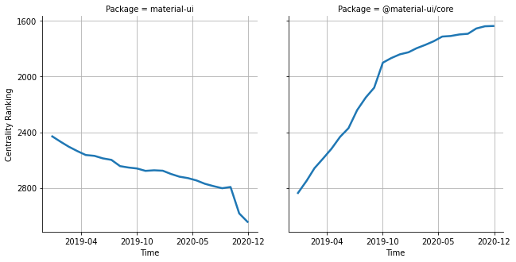

# [`material-ui`](https://www.npmjs.com/package/material-ui) -> [`@material-ui/core`](https://www.npmjs.com/package/@material-ui/core)

The following figure compares the over time centrality ranking of [`material-ui`](https://www.npmjs.com/package/material-ui) and [`@material-ui/core`](https://www.npmjs.com/package/@material-ui/core).

## Pull request examples

The following are examples of pull requests that perform a dependency migration from [`material-ui`](https://www.npmjs.com/package/material-ui) to [`@material-ui/core`](https://www.npmjs.com/package/@material-ui/core):

- [callemall/material-ui#11359](https://github.com/callemall/material-ui/pull/11359)
- [vazco/uniforms#427](https://github.com/vazco/uniforms/pull/427)
- [eclipsesource/jsonforms#977](https://github.com/eclipsesource/jsonforms/pull/977)
- [jaredpalmer/razzle#1041](https://github.com/jaredpalmer/razzle/pull/1041)

## What is package centrality?

By definition, centrality is a measure of the prominence or importance of a node in a social network.
In our context, the centrality allows us to rank the packages based on the popularity/importance of packages that depend on them.
Specifically, we use the PageRank algorithm to evaluate the shift in their centrality over time.
For more details read our research paper: [Towards Using Package Centrality Trend to Identify Packages in Decline](https://arxiv.org/abs/2107.10168).
