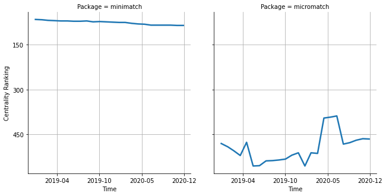

# [`isomorphic-fetch`](https://www.npmjs.com/package/minimatch) -> [`micromatch`](https://www.npmjs.com/package/micromatch)

The following figure compares the over time centrality ranking of [`minimatch`](https://www.npmjs.com/package/minimatch) and [`micromatch`](https://www.npmjs.com/package/micromatch).

## Pull request examples

The following are examples of pull requests that perform a dependency migration from [`minimatch`](https://www.npmjs.com/package/minimatch) to [`micromatch`](https://www.npmjs.com/package/micromatch):

- [babel/babel#5487](https://github.com/babel/babel/pull/5487)
- [untool/untool#39](https://github.com/untool/untool/pull/39)
- [traveloka/javascript#21](https://github.com/traveloka/javascript/pull/21)

## What is package centrality?

By definition, centrality is a measure of the prominence or importance of a node in a social network.
In our context, the centrality allows us to rank the packages based on the popularity/importance of packages that depend on them.
Specifically, we use the PageRank algorithm to evaluate the shift in their centrality over time.
For more details read our research paper: [Towards Using Package Centrality Trend to Identify Packages in Decline](https://arxiv.org/abs/2107.10168).
