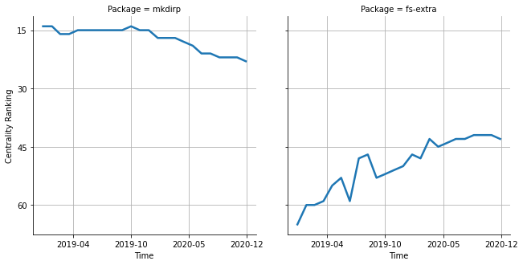

# [`mkdirp`](https://www.npmjs.com/package/mkdirp) -> [`fs-extra`](https://www.npmjs.com/package/fs-extra)

The following figure compares the over time centrality ranking of [`mkdirp`](https://www.npmjs.com/package/mkdirp) and [`fs-extra`](https://www.npmjs.com/package/fs-extra).

## A pull request example

The following is an example of a pull request that perform a dependency migration from [`mkdirp`](https://www.npmjs.com/package/mkdirp) to [`fs-extra`](https://www.npmjs.com/package/fs-extra):

- [alibaba/rax#806](https://github.com/alibaba/rax/pull/806)

## What is package centrality?

By definition, centrality is a measure of the prominence or importance of a node in a social network.
In our context, the centrality allows us to rank the packages based on the popularity/importance of packages that depend on them.
Specifically, we use the PageRank algorithm to evaluate the shift in their centrality over time.
For more details read our research paper: [Towards Using Package Centrality Trend to Identify Packages in Decline](https://arxiv.org/abs/2107.10168).
