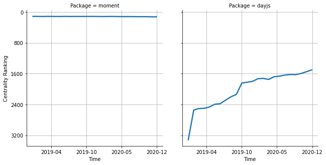

# [`moment`](https://www.npmjs.com/package/moment) -> [`dayjs`](https://www.npmjs.com/package/dayjs)

The following figure compares the over time centrality ranking of [`moment`](https://www.npmjs.com/package/moment) and [`dayjs`](https://www.npmjs.com/package/dayjs).

## A pull request example

The following is an example of a pull request that perform a dependency migration from [`moment`](https://www.npmjs.com/package/moment) to [`dayjs`](https://www.npmjs.com/package/dayjs):

- [Microsoft/vscode-azuretools#808](https://github.com/Microsoft/vscode-azuretools/pull/808)

## What is package centrality?

By definition, centrality is a measure of the prominence or importance of a node in a social network.
In our context, the centrality allows us to rank the packages based on the popularity/importance of packages that depend on them.
Specifically, we use the PageRank algorithm to evaluate the shift in their centrality over time.
For more details read our research paper: [Towards Using Package Centrality Trend to Identify Packages in Decline](https://arxiv.org/abs/2107.10168).
