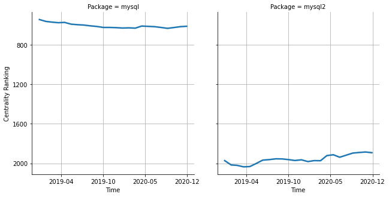

# [`isomorphic-fetch`](https://www.npmjs.com/package/mysql) -> [`mysql2`](https://www.npmjs.com/package/mysql2)

The following figure compares the over time centrality ranking of [`mysql`](https://www.npmjs.com/package/mysql) and [`mysql2`](https://www.npmjs.com/package/mysql2).

## A pull request example

The following is an example of a pull request that perform a dependency migration from [`mysql`](https://www.npmjs.com/package/mysql) to [`mysql2`](https://www.npmjs.com/package/mysql2):

- [LeoPlatform/connectors#17](https://github.com/LeoPlatform/connectors/pull/17)

## What is package centrality?

By definition, centrality is a measure of the prominence or importance of a node in a social network.
In our context, the centrality allows us to rank the packages based on the popularity/importance of packages that depend on them.
Specifically, we use the PageRank algorithm to evaluate the shift in their centrality over time.
For more details read our research paper: [Towards Using Package Centrality Trend to Identify Packages in Decline](https://arxiv.org/abs/2107.10168).
