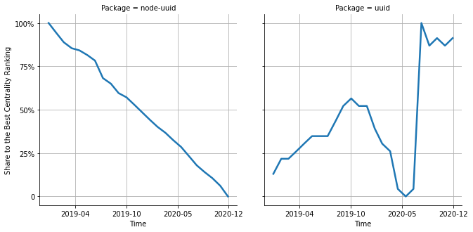

# [`isomorphic-fetch`](https://www.npmjs.com/package/node-uuid) -> [`uuid`](https://www.npmjs.com/package/uuid)

The following figure compares the over time centrality ranking of [`node-uuid`](https://www.npmjs.com/package/node-uuid) and [`uuid`](https://www.npmjs.com/package/uuid).

## Pull request examples

The following are examples of pull requests that perform a dependency migration from [`node-uuid`](https://www.npmjs.com/package/node-uuid) to [`uuid`](https://www.npmjs.com/package/uuid):

- [Microsoft/vsts-task-lib#225](https://github.com/Microsoft/vsts-task-lib/pull/225)
- [compose-us/todastic#19](https://github.com/compose-us/todastic/pull/19)
- [angular/angular-cli#3246](https://github.com/angular/angular-cli/pull/3246)

## What is package centrality?

By definition, centrality is a measure of the prominence or importance of a node in a social network.
In our context, the centrality allows us to rank the packages based on the popularity/importance of packages that depend on them.
Specifically, we use the PageRank algorithm to evaluate the shift in their centrality over time.
For more details read our research paper: [Towards Using Package Centrality Trend to Identify Packages in Decline](https://arxiv.org/abs/2107.10168).
