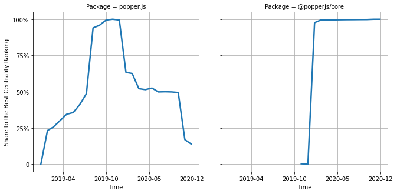

# [`isomorphic-fetch`](https://www.npmjs.com/package/popper.js) -> [`@popperjs/core`](https://www.npmjs.com/package/@popperjs/core)

The following figure compares the over time centrality ranking of [`popper.js`](https://www.npmjs.com/package/popper.js) and [`@popperjs/core`](https://www.npmjs.com/package/@popperjs/core).

## Pull request examples

The following are examples of pull requests that perform a dependency migration from [`popper.js`](https://www.npmjs.com/package/popper.js) to [`@popperjs/core`](https://www.npmjs.com/package/@popperjs/core):

- [reakit/reakit#545](https://github.com/reakit/reakit/pull/545)
- [bigcommerce/big-design#364](https://github.com/bigcommerce/big-design/pull/364)
- [chakra-ui/chakra-ui-vue#168](https://github.com/chakra-ui/chakra-ui-vue/pull/168)
- [callemall/material-ui#21761](https://github.com/callemall/material-ui/pull/21761)
- [storybookjs/storybook#11827](https://github.com/storybookjs/storybook/pull/11827)

## What is package centrality?

By definition, centrality is a measure of the prominence or importance of a node in a social network.
In our context, the centrality allows us to rank the packages based on the popularity/importance of packages that depend on them.
Specifically, we use the PageRank algorithm to evaluate the shift in their centrality over time.
For more details read our research paper: [Towards Using Package Centrality Trend to Identify Packages in Decline](https://arxiv.org/abs/2107.10168).
