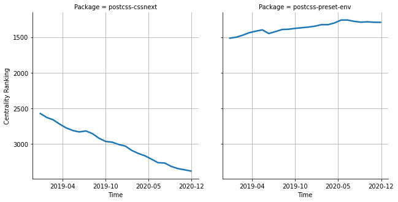

# [`isomorphic-fetch`](https://www.npmjs.com/package/postcss-cssnext) -> [`postcss-preset-env`](https://www.npmjs.com/package/postcss-preset-env)

The following figure compares the over time centrality ranking of [`postcss-cssnext`](https://www.npmjs.com/package/postcss-cssnext) and [`postcss-preset-env`](https://www.npmjs.com/package/postcss-preset-env).

## A pull request example

The following is an example of a pull request that perform a dependency migration from [`postcss-cssnext`](https://www.npmjs.com/package/postcss-cssnext) to [`postcss-preset-env`](https://www.npmjs.com/package/postcss-preset-env):

- [gauntface/hopin-web-build-tools#158](https://github.com/gauntface/hopin-web-build-tools/pull/158)

## What is package centrality?

By definition, centrality is a measure of the prominence or importance of a node in a social network.
In our context, the centrality allows us to rank the packages based on the popularity/importance of packages that depend on them.
Specifically, we use the PageRank algorithm to evaluate the shift in their centrality over time.
For more details read our research paper: [Towards Using Package Centrality Trend to Identify Packages in Decline](https://arxiv.org/abs/2107.10168).
