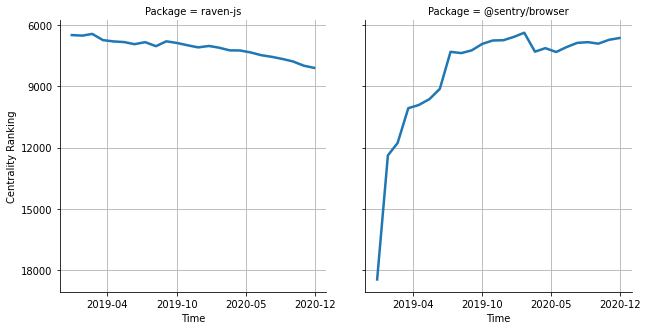

# [`isomorphic-fetch`](https://www.npmjs.com/package/raven-js) -> [`@sentry/browser`](https://www.npmjs.com/package/@sentry/browser)

The following figure compares the over time centrality ranking of [`raven-js`](https://www.npmjs.com/package/raven-js) and [`@sentry/browser`](https://www.npmjs.com/package/@sentry/browser).

## Pull request examples

The following are examples of pull requests that perform a dependency migration from [`raven-js`](https://www.npmjs.com/package/raven-js) to [`@sentry/browser`](https://www.npmjs.com/package/@sentry/browser):

- [OpenNeuroOrg/openneuro#1040](https://github.com/OpenNeuroOrg/openneuro/pull/1040)
- [commercetools/merchant-center-application-kit#476](https://github.com/commercetools/merchant-center-application-kit/pull/476)
- [airbnb/lunar#125](https://github.com/airbnb/lunar/pull/125)

## What is package centrality?

By definition, centrality is a measure of the prominence or importance of a node in a social network.
In our context, the centrality allows us to rank the packages based on the popularity/importance of packages that depend on them.
Specifically, we use the PageRank algorithm to evaluate the shift in their centrality over time.
For more details read our research paper: [Towards Using Package Centrality Trend to Identify Packages in Decline](https://arxiv.org/abs/2107.10168).
