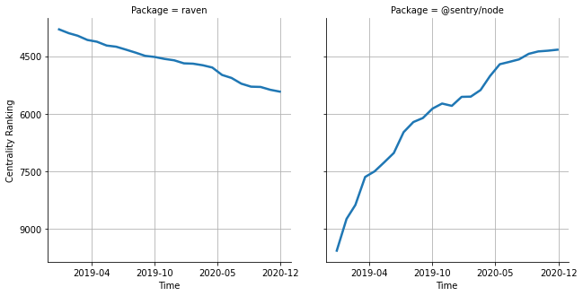

# [`raven`](https://www.npmjs.com/package/raven) -> [`@sentry/node`](https://www.npmjs.com/package/@sentry/node)

The following figure compares the over time centrality ranking of [`raven`](https://www.npmjs.com/package/raven) and [`@sentry/node`](https://www.npmjs.com/package/@sentry/node).

## A pull request example

The following is an example of a pull request that perform a dependency migration from [`raven`](https://www.npmjs.com/package/raven) to [`@sentry/node`](https://www.npmjs.com/package/@sentry/node):

- [OpenNeuroOrg/openneuro#1040](https://github.com/OpenNeuroOrg/openneuro/pull/1040)

## What is package centrality?

By definition, centrality is a measure of the prominence or importance of a node in a social network.
In our context, the centrality allows us to rank the packages based on the popularity/importance of packages that depend on them.
Specifically, we use the PageRank algorithm to evaluate the shift in their centrality over time.
For more details read our research paper: [Towards Using Package Centrality Trend to Identify Packages in Decline](https://arxiv.org/abs/2107.10168).
