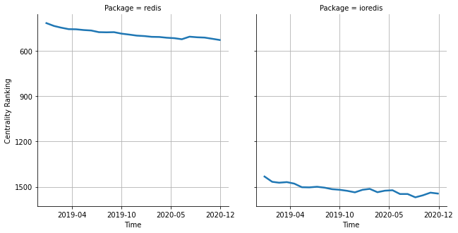

# [`isomorphic-fetch`](https://www.npmjs.com/package/redis) -> [`ioredis`](https://www.npmjs.com/package/ioredis)

The following figure compares the over time centrality ranking of [`redis`](https://www.npmjs.com/package/redis) and [`ioredis`](https://www.npmjs.com/package/ioredis).

## Pull request examples

The following are examples of pull requests that perform a dependency migration from [`redis`](https://www.npmjs.com/package/redis) to [`ioredis`](https://www.npmjs.com/package/ioredis):

- [apollographql/apollo-server#1770](https://github.com/apollographql/apollo-server/pull/1770)
- [apollographql/apollo-server#2669](https://github.com/apollographql/apollo-server/pull/2669)

## What is package centrality?

By definition, centrality is a measure of the prominence or importance of a node in a social network.
In our context, the centrality allows us to rank the packages based on the popularity/importance of packages that depend on them.
Specifically, we use the PageRank algorithm to evaluate the shift in their centrality over time.
For more details read our research paper: [Towards Using Package Centrality Trend to Identify Packages in Decline](https://arxiv.org/abs/2107.10168).
