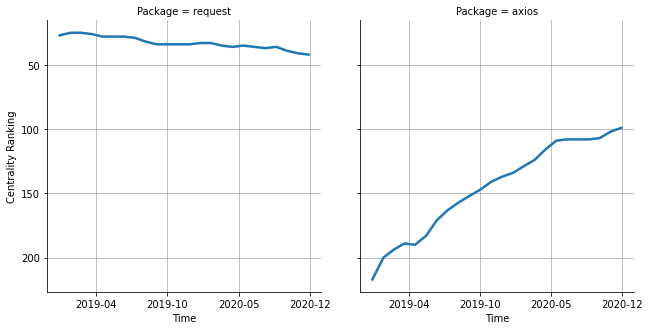

# [`isomorphic-fetch`](https://www.npmjs.com/package/request) -> [`axios`](https://www.npmjs.com/package/axios)

The following figure compares the over time centrality ranking of [`request`](https://www.npmjs.com/package/request) and [`axios`](https://www.npmjs.com/package/axios).

## A pull request example

The following is an example of a pull request that perform a dependency migration from [`request`](https://www.npmjs.com/package/request) to [`axios`](https://www.npmjs.com/package/axios):

- [RauliL/varasto#8](https://github.com/RauliL/varasto/pull/8)

## What is package centrality?

By definition, centrality is a measure of the prominence or importance of a node in a social network.
In our context, the centrality allows us to rank the packages based on the popularity/importance of packages that depend on them.
Specifically, we use the PageRank algorithm to evaluate the shift in their centrality over time.
For more details read our research paper: [Towards Using Package Centrality Trend to Identify Packages in Decline](https://arxiv.org/abs/2107.10168).
