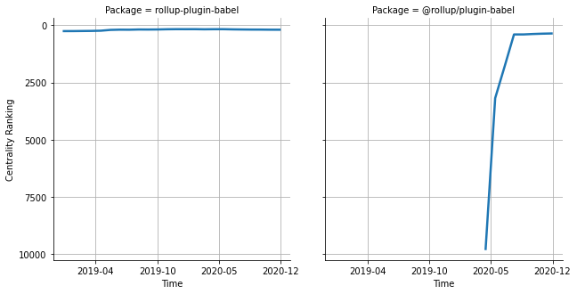

# [`rollup-plugin-babel`](https://www.npmjs.com/package/rollup-plugin-babel) -> [`@rollup/plugin-babel`](https://www.npmjs.com/package/@rollup/plugin-babel)

The following figure compares the over time centrality ranking of [`rollup-plugin-babel`](https://www.npmjs.com/package/rollup-plugin-babel) and [`@rollup/plugin-babel`](https://www.npmjs.com/package/@rollup/plugin-babel).

## Pull request examples

The following are examples of pull requests that perform a dependency migration from [`rollup-plugin-babel`](https://www.npmjs.com/package/rollup-plugin-babel) to [`@rollup/plugin-babel`](https://www.npmjs.com/package/@rollup/plugin-babel):

- [googlechrome/workbox#2481](https://github.com/googlechrome/workbox/pull/2481)
- [ovh-ux/manager#2879](https://github.com/ovh-ux/manager/pull/2879)
- [open-wc/open-wc#1802](https://github.com/open-wc/open-wc/pull/1802)

## What is package centrality?

By definition, centrality is a measure of the prominence or importance of a node in a social network.
In our context, the centrality allows us to rank the packages based on the popularity/importance of packages that depend on them.
Specifically, we use the PageRank algorithm to evaluate the shift in their centrality over time.
For more details read our research paper: [Towards Using Package Centrality Trend to Identify Packages in Decline](https://arxiv.org/abs/2107.10168).
