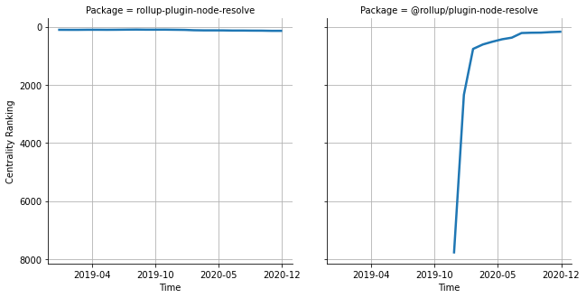

# [`rollup-plugin-node-resolve`](https://www.npmjs.com/package/rollup-plugin-node-resolve) -> [`@rollup/plugin-node-resolve`](https://www.npmjs.com/package/@rollup/plugin-node-resolve)

The following figure compares the over time centrality ranking of [`rollup-plugin-node-resolve`](https://www.npmjs.com/package/rollup-plugin-node-resolve) and [`@rollup/plugin-node-resolve`](https://www.npmjs.com/package/@rollup/plugin-node-resolve).

## Pull request examples

The following are examples of pull requests that perform a dependency migration from [`rollup-plugin-node-resolve`](https://www.npmjs.com/package/rollup-plugin-node-resolve) to [`@rollup/plugin-node-resolve`](https://www.npmjs.com/package/@rollup/plugin-node-resolve):

- [open-wc/open-wc#1137](https://github.com/open-wc/open-wc/pull/1137)
- [Azure/azure-sdk-for-js#6856](https://github.com/Azure/azure-sdk-for-js/pull/6856)
- [sakuli/sakuli#531](https://github.com/sakuli/sakuli/pull/531)

## What is package centrality?

By definition, centrality is a measure of the prominence or importance of a node in a social network.
In our context, the centrality allows us to rank the packages based on the popularity/importance of packages that depend on them.
Specifically, we use the PageRank algorithm to evaluate the shift in their centrality over time.
For more details read our research paper: [Towards Using Package Centrality Trend to Identify Packages in Decline](https://arxiv.org/abs/2107.10168).
