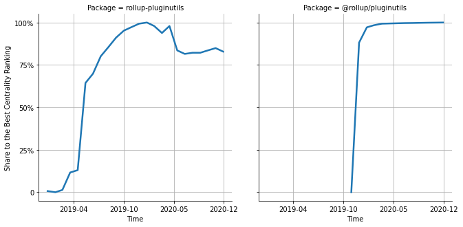

# [`isomorphic-fetch`](https://www.npmjs.com/package/rollup-pluginutils) -> [`@rollup/pluginutils`](https://www.npmjs.com/package/@rollup/pluginutils)

The following figure compares the over time centrality ranking of [`rollup-pluginutils`](https://www.npmjs.com/package/rollup-pluginutils) and [`@rollup/pluginutils`](https://www.npmjs.com/package/@rollup/pluginutils).

## Pull request examples

The following are examples of pull requests that perform a dependency migration from [`rollup-pluginutils`](https://www.npmjs.com/package/rollup-pluginutils) to [`@rollup/pluginutils`](https://www.npmjs.com/package/@rollup/pluginutils):

- [rollup/plugins#136](https://github.com/rollup/plugins/pull/136)
- [rollup/plugins#137](https://github.com/rollup/plugins/pull/137)
- [rollup/plugins#160](https://github.com/rollup/plugins/pull/160)

## What is package centrality?

By definition, centrality is a measure of the prominence or importance of a node in a social network.
In our context, the centrality allows us to rank the packages based on the popularity/importance of packages that depend on them.
Specifically, we use the PageRank algorithm to evaluate the shift in their centrality over time.
For more details read our research paper: [Towards Using Package Centrality Trend to Identify Packages in Decline](https://arxiv.org/abs/2107.10168).
