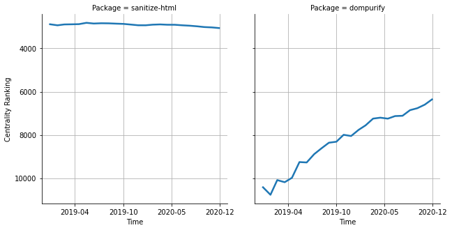

# [`sanitize-html`](https://www.npmjs.com/package/sanitize-html) -> [`dompurify`](https://www.npmjs.com/package/dompurify)

The following figure compares the over time centrality ranking of [`sanitize-html`](https://www.npmjs.com/package/sanitize-html) and [`dompurify`](https://www.npmjs.com/package/dompurify).

## A pull request example

The following is an example of a pull request that perform a dependency migration from [`sanitize-html`](https://www.npmjs.com/package/sanitize-html) to [`dompurify`](https://www.npmjs.com/package/dompurify):

- [NYPL-Simplified/opds-browser#115](https://github.com/NYPL-Simplified/opds-browser/pull/115)

## What is package centrality?

By definition, centrality is a measure of the prominence or importance of a node in a social network.
In our context, the centrality allows us to rank the packages based on the popularity/importance of packages that depend on them.
Specifically, we use the PageRank algorithm to evaluate the shift in their centrality over time.
For more details read our research paper: [Towards Using Package Centrality Trend to Identify Packages in Decline](https://arxiv.org/abs/2107.10168).
