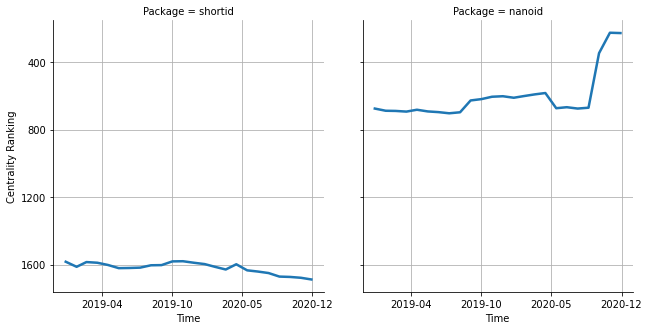

# [`isomorphic-fetch`](https://www.npmjs.com/package/shortid) -> [`nanoid`](https://www.npmjs.com/package/nanoid)

The following figure compares the over time centrality ranking of [`shortid`](https://www.npmjs.com/package/shortid) and [`nanoid`](https://www.npmjs.com/package/nanoid).

## Pull request examples

The following are examples of pull requests that perform a dependency migration from [`shortid`](https://www.npmjs.com/package/shortid) to [`nanoid`](https://www.npmjs.com/package/nanoid):

- [terascope/teraslice#1930](https://github.com/terascope/teraslice/pull/1930)
- [prosejs/prose#45](https://github.com/prosejs/prose/pull/45)
- [readmeio/api-explorer#1095](https://github.com/readmeio/api-explorer/pull/1095)

## What is package centrality?

By definition, centrality is a measure of the prominence or importance of a node in a social network.
In our context, the centrality allows us to rank the packages based on the popularity/importance of packages that depend on them.
Specifically, we use the PageRank algorithm to evaluate the shift in their centrality over time.
For more details read our research paper: [Towards Using Package Centrality Trend to Identify Packages in Decline](https://arxiv.org/abs/2107.10168).
