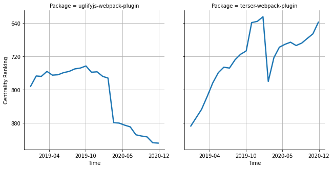

# [`isomorphic-fetch`](https://www.npmjs.com/package/uglifyjs-webpack-plugin) -> [`terser-webpack-plugin`](https://www.npmjs.com/package/terser-webpack-plugin)

The following figure compares the over time centrality ranking of [`uglifyjs-webpack-plugin`](https://www.npmjs.com/package/uglifyjs-webpack-plugin) and [`terser-webpack-plugin`](https://www.npmjs.com/package/terser-webpack-plugin).

## Pull request examples

The following are examples of pull requests that perform a dependency migration from [`uglifyjs-webpack-plugin`](https://www.npmjs.com/package/uglifyjs-webpack-plugin) to [`terser-webpack-plugin`](https://www.npmjs.com/package/terser-webpack-plugin):

- [goldwasserexchange/public#51](https://github.com/goldwasserexchange/public/pull/51)
- [facebook/create-react-app#5026](https://github.com/facebook/create-react-app/pull/5026)
- [nuxt/nuxt.js#3928](https://github.com/nuxt/nuxt.js/pull/3928)
- [angular/angular-cli#11996](https://github.com/angular/angular-cli/pull/11996)
- [vuejs/vue-cli#2742](https://github.com/vuejs/vue-cli/pull/2742)

## What is package centrality?

By definition, centrality is a measure of the prominence or importance of a node in a social network.
In our context, the centrality allows us to rank the packages based on the popularity/importance of packages that depend on them.
Specifically, we use the PageRank algorithm to evaluate the shift in their centrality over time.
For more details read our research paper: [Towards Using Package Centrality Trend to Identify Packages in Decline](https://arxiv.org/abs/2107.10168).
