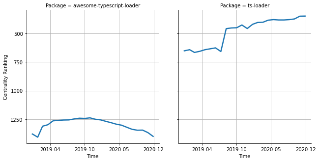

# [`isomorphic-fetch`](https://www.npmjs.com/package/awesome-typescript-loader) -> [`ts-loader`](https://www.npmjs.com/package/ts-loader)

The following figure compares the over time centrality ranking of [`awesome-typescript-loader`](https://www.npmjs.com/package/awesome-typescript-loader) and [`ts-loader`](https://www.npmjs.com/package/ts-loader).

## A pull request example

The following is an example of a pull request that perform a dependency migration from [`awesome-typescript-loader`](https://www.npmjs.com/package/awesome-typescript-loader) to [`ts-loader`](https://www.npmjs.com/package/ts-loader):

- [elyra-ai/elyra#364](https://github.com/elyra-ai/elyra/pull/364)

## What is package centrality?

By definition, centrality is a measure of the prominence or importance of a node in a social network.
In our context, the centrality allows us to rank the packages based on the popularity/importance of packages that depend on them.
Specifically, we use the PageRank algorithm to evaluate the shift in their centrality over time.
For more details read our research paper: [Towards Using Package Centrality Trend to Identify Packages in Decline](https://arxiv.org/abs/2107.10168).
