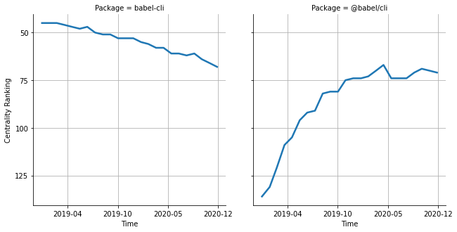

# [`isomorphic-fetch`](https://www.npmjs.com/package/babel-cli) -> [`@babel/cli`](https://www.npmjs.com/package/@babel/cli)

The following figure compares the over time centrality ranking of [`babel-cli`](https://www.npmjs.com/package/babel-cli) and [`@babel/cli`](https://www.npmjs.com/package/@babel/cli).

## Pull request examples

The following are examples of pull requests that perform a dependency migration from [`babel-cli`](https://www.npmjs.com/package/babel-cli) to [`@babel/cli`](https://www.npmjs.com/package/@babel/cli):

- [cozy/cozy-libs#65](https://github.com/cozy/cozy-libs/pull/65)
- [sanity-io/sanity#946](https://github.com/sanity-io/sanity/pull/946)
- [react-atomic/reshow#10](https://github.com/react-atomic/reshow/pull/10)
- [SUI-Components/sui#501](https://github.com/SUI-Components/sui/pull/501)
- [SUI-Components/sui#510](https://github.com/SUI-Components/sui/pull/510)

## What is package centrality?

By definition, centrality is a measure of the prominence or importance of a node in a social network.
In our context, the centrality allows us to rank the packages based on the popularity/importance of packages that depend on them.
Specifically, we use the PageRank algorithm to evaluate the shift in their centrality over time.
For more details read our research paper: [Towards Using Package Centrality Trend to Identify Packages in Decline](https://arxiv.org/abs/2107.10168).
