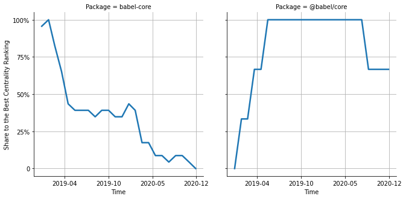

# [`isomorphic-fetch`](https://www.npmjs.com/package/babel-core) -> [`@babel/core`](https://www.npmjs.com/package/@babel/core)

The following figure compares the over time centrality ranking of [`babel-core`](https://www.npmjs.com/package/babel-core) and [`@babel/core`](https://www.npmjs.com/package/@babel/core).

## Pull request examples

The following are examples of pull requests that perform a dependency migration from [`babel-core`](https://www.npmjs.com/package/babel-core) to [`@babel/core`](https://www.npmjs.com/package/@babel/core):

- [egoist/poi#374](https://github.com/egoist/poi/pull/374)
- [Codecademy/client-modules#145](https://github.com/Codecademy/client-modules/pull/145)
- [facebook/fbjs#303](https://github.com/facebook/fbjs/pull/303)
- [8base/sdk#265](https://github.com/8base/sdk/pull/265)
- [newsuk/times-components#2156](https://github.com/newsuk/times-components/pull/2156)

## What is package centrality?

By definition, centrality is a measure of the prominence or importance of a node in a social network.
In our context, the centrality allows us to rank the packages based on the popularity/importance of packages that depend on them.
Specifically, we use the PageRank algorithm to evaluate the shift in their centrality over time.
For more details read our research paper: [Towards Using Package Centrality Trend to Identify Packages in Decline](https://arxiv.org/abs/2107.10168).
