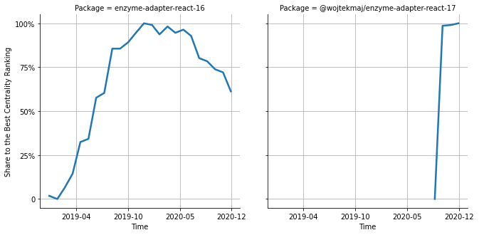

# [`enzyme-adapter-react-16`](https://www.npmjs.com/package/enzyme-adapter-react-16) -> [`@wojtekmaj/enzyme-adapter-react-17`](https://www.npmjs.com/package/@wojtekmaj/enzyme-adapter-react-17)

The following figure compares the over time centrality ranking of [`enzyme-adapter-react-16`](https://www.npmjs.com/package/enzyme-adapter-react-16) and [`@wojtekmaj/enzyme-adapter-react-17`](https://www.npmjs.com/package/@wojtekmaj/enzyme-adapter-react-17).

## Pull request examples

The following are examples of pull requests that perform a dependency migration from [`enzyme-adapter-react-16`](https://www.npmjs.com/package/enzyme-adapter-react-16) to [`@wojtekmaj/enzyme-adapter-react-17`](https://www.npmjs.com/package/@wojtekmaj/enzyme-adapter-react-17):

- [godaddy/gasket#216](https://github.com/godaddy/gasket/pull/216)
- [JetBrains/ring-ui#3090](https://github.com/JetBrains/ring-ui/pull/3090)

## What is package centrality?

By definition, centrality is a measure of the prominence or importance of a node in a social network.
In our context, the centrality allows us to rank the packages based on the popularity/importance of packages that depend on them.
Specifically, we use the PageRank algorithm to evaluate the shift in their centrality over time.
For more details read our research paper: [Towards Using Package Centrality Trend to Identify Packages in Decline](https://arxiv.org/abs/2107.10168).
