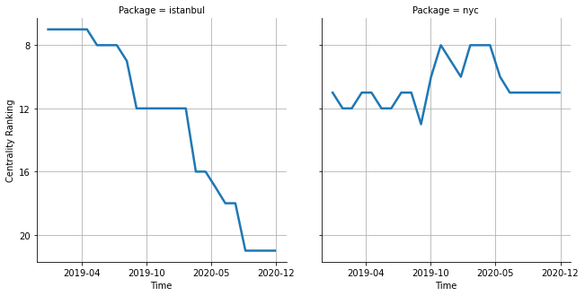

# [`istanbul`](https://www.npmjs.com/package/istanbul) -> [`nyc`](https://www.npmjs.com/package/nyc)

The following figure compares the over time centrality ranking of [`istanbul`](https://www.npmjs.com/package/istanbul) and [`nyc`](https://www.npmjs.com/package/nyc).

## Pull request examples

The following are examples of pull requests that perform a dependency migration from [`istanbul`](https://www.npmjs.com/package/istanbul) to [`nyc`](https://www.npmjs.com/package/nyc):

- [wireapp/wire-web-packages#1471](https://github.com/wireapp/wire-web-packages/pull/1471)
- [prescottprue/generator-react-firebase#149](https://github.com/prescottprue/generator-react-firebase/pull/149)
- [optimizely/javascript-sdk#475](https://github.com/optimizely/javascript-sdk/pull/475)

## What is package centrality?

By definition, centrality is a measure of the prominence or importance of a node in a social network.
In our context, the centrality allows us to rank the packages based on the popularity/importance of packages that depend on them.
Specifically, we use the PageRank algorithm to evaluate the shift in their centrality over time.
For more details read our research paper: [Towards Using Package Centrality Trend to Identify Packages in Decline](https://arxiv.org/abs/2107.10168).
