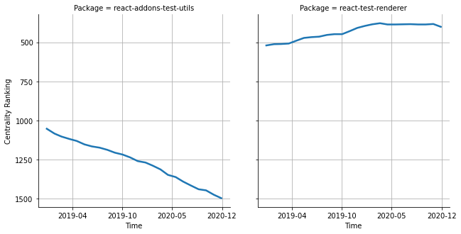

# [`isomorphic-fetch`](https://www.npmjs.com/package/react-addons-test-utils) -> [`react-test-renderer`](https://www.npmjs.com/package/react-test-renderer)

The following figure compares the over time centrality ranking of [`react-addons-test-utils`](https://www.npmjs.com/package/react-addons-test-utils) and [`react-test-renderer`](https://www.npmjs.com/package/react-test-renderer).

## Pull request examples

The following are examples of pull requests that perform a dependency migration from [`react-addons-test-utils`](https://www.npmjs.com/package/react-addons-test-utils) to [`react-test-renderer`](https://www.npmjs.com/package/react-test-renderer):

- [DevExpress/devextreme-reactive#54](https://github.com/DevExpress/devextreme-reactive/pull/54)
- [lab009/teide#10](https://github.com/lab009/teide/pull/10)
- [palantir/blueprint#1088](https://github.com/palantir/blueprint/pull/1088)
- [williaster/data-ui#17](https://github.com/williaster/data-ui/pull/17)
- [hshoff/vx#155](https://github.com/hshoff/vx/pull/155)

## What is package centrality?

By definition, centrality is a measure of the prominence or importance of a node in a social network.
In our context, the centrality allows us to rank the packages based on the popularity/importance of packages that depend on them.
Specifically, we use the PageRank algorithm to evaluate the shift in their centrality over time.
For more details read our research paper: [Towards Using Package Centrality Trend to Identify Packages in Decline](https://arxiv.org/abs/2107.10168).
