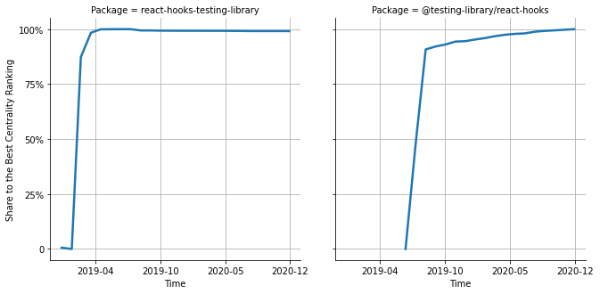

# [`react-hooks-testing-library`](https://www.npmjs.com/package/react-hooks-testing-library) -> [`@testing-library/react-hooks`](https://www.npmjs.com/package/@testing-library/react-hooks)

The following figure compares the over time centrality ranking of [`react-hooks-testing-library`](https://www.npmjs.com/package/react-hooks-testing-library) and [`@testing-library/react-hooks`](https://www.npmjs.com/package/@testing-library/react-hooks).

## A pull request example

The following is an example of a pull request that perform a dependency migration from [`react-hooks-testing-library`](https://www.npmjs.com/package/react-hooks-testing-library) to [`@testing-library/react-hooks`](https://www.npmjs.com/package/@testing-library/react-hooks):

- [nearform/graphql-hooks#341](https://github.com/nearform/graphql-hooks/pull/341)

## What is package centrality?

By definition, centrality is a measure of the prominence or importance of a node in a social network.
In our context, the centrality allows us to rank the packages based on the popularity/importance of packages that depend on them.
Specifically, we use the PageRank algorithm to evaluate the shift in their centrality over time.
For more details read our research paper: [Towards Using Package Centrality Trend to Identify Packages in Decline](https://arxiv.org/abs/2107.10168).
