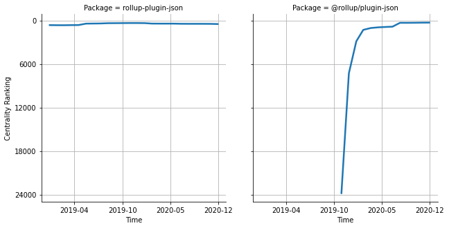

# [`rollup-plugin-json`](https://www.npmjs.com/package/rollup-plugin-json) -> [`@rollup/plugin-json`](https://www.npmjs.com/package/@rollup/plugin-json)

The following figure compares the over time centrality ranking of [`rollup-plugin-json`](https://www.npmjs.com/package/rollup-plugin-json) and [`@rollup/plugin-json`](https://www.npmjs.com/package/@rollup/plugin-json).

## Pull request examples

The following are examples of pull requests that perform a dependency migration from [`rollup-plugin-json`](https://www.npmjs.com/package/rollup-plugin-json) to [`@rollup/plugin-json`](https://www.npmjs.com/package/@rollup/plugin-json):

- [Azure/azure-sdk-for-js#6227](https://github.com/Azure/azure-sdk-for-js/pull/6227)
- [firebase/firebase-js-sdk#3930](https://github.com/firebase/firebase-js-sdk/pull/3930)
- [firebase/firebase-js-sdk#4234](https://github.com/firebase/firebase-js-sdk/pull/4234)

## What is package centrality?

By definition, centrality is a measure of the prominence or importance of a node in a social network.
In our context, the centrality allows us to rank the packages based on the popularity/importance of packages that depend on them.
Specifically, we use the PageRank algorithm to evaluate the shift in their centrality over time.
For more details read our research paper: [Towards Using Package Centrality Trend to Identify Packages in Decline](https://arxiv.org/abs/2107.10168).
