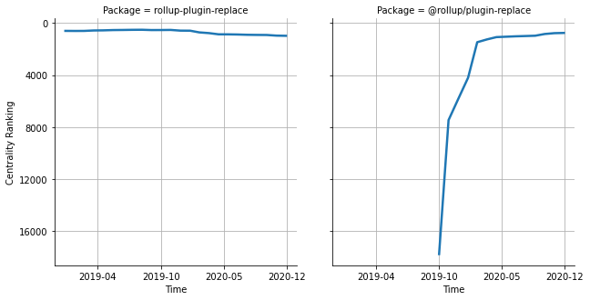

# [`isomorphic-fetch`](https://www.npmjs.com/package/rollup-plugin-replace) -> [`@rollup/plugin-replace`](https://www.npmjs.com/package/@rollup/plugin-replace)

The following figure compares the over time centrality ranking of [`rollup-plugin-replace`](https://www.npmjs.com/package/rollup-plugin-replace) and [`@rollup/plugin-replace`](https://www.npmjs.com/package/@rollup/plugin-replace).

## Pull request examples

The following are examples of pull requests that perform a dependency migration from [`rollup-plugin-replace`](https://www.npmjs.com/package/rollup-plugin-replace) to [`@rollup/plugin-replace`](https://www.npmjs.com/package/@rollup/plugin-replace):

- [Azure/azure-sdk-for-js#6053](https://github.com/Azure/azure-sdk-for-js/pull/6053)
- [DevExpress/devextreme-reactive#2732](https://github.com/DevExpress/devextreme-reactive/pull/2732)

## What is package centrality?

By definition, centrality is a measure of the prominence or importance of a node in a social network.
In our context, the centrality allows us to rank the packages based on the popularity/importance of packages that depend on them.
Specifically, we use the PageRank algorithm to evaluate the shift in their centrality over time.
For more details read our research paper: [Towards Using Package Centrality Trend to Identify Packages in Decline](https://arxiv.org/abs/2107.10168).
