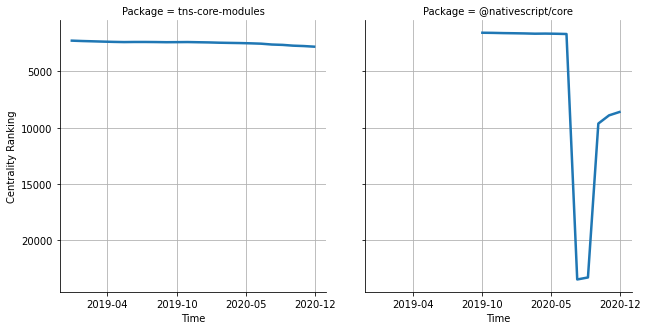

# [`tns-core-modules`](https://www.npmjs.com/package/tns-core-modules) -> [`@nativescript/core`](https://www.npmjs.com/package/@nativescript/core)

The following figure compares the over time centrality ranking of [`tns-core-modules`](https://www.npmjs.com/package/tns-core-modules) and [`@nativescript/core`](https://www.npmjs.com/package/@nativescript/core).

## Pull request examples

The following are examples of pull requests that perform a dependency migration from [`tns-core-modules`](https://www.npmjs.com/package/tns-core-modules) to [`@nativescript/core`](https://www.npmjs.com/package/@nativescript/core):

- [triniwiz/nativescript-browser-polyfill#1](https://github.com/triniwiz/nativescript-browser-polyfill/pull/1)
- [triniwiz/nativescript-phaser#1](https://github.com/triniwiz/nativescript-phaser/pull/1)
- [triniwiz/nativescript-phaser-ce#1](https://github.com/triniwiz/nativescript-phaser-ce/pull/1)
- [triniwiz/nativescript-three#3](https://github.com/triniwiz/nativescript-three/pull/3)

## What is package centrality?

By definition, centrality is a measure of the prominence or importance of a node in a social network.
In our context, the centrality allows us to rank the packages based on the popularity/importance of packages that depend on them.
Specifically, we use the PageRank algorithm to evaluate the shift in their centrality over time.
For more details read our research paper: [Towards Using Package Centrality Trend to Identify Packages in Decline](https://arxiv.org/abs/2107.10168).
