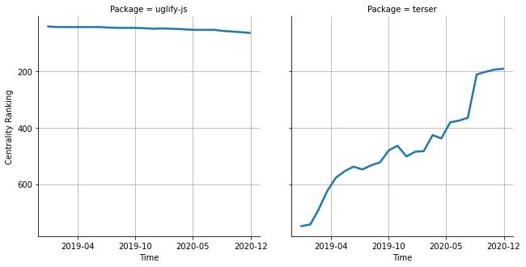

# [`isomorphic-fetch`](https://www.npmjs.com/package/uglify-js) -> [`terser`](https://www.npmjs.com/package/terser)

The following figure compares the over time centrality ranking of [`uglify-js`](https://www.npmjs.com/package/uglify-js) and [`terser`](https://www.npmjs.com/package/terser).

## Pull request examples

The following are examples of pull requests that perform a dependency migration from [`uglify-js`](https://www.npmjs.com/package/uglify-js) to [`terser`](https://www.npmjs.com/package/terser):

- [sanity-io/sanity#1044](https://github.com/sanity-io/sanity/pull/1044)
- [ionic-team/capacitor#1575](https://github.com/ionic-team/capacitor/pull/1575)

## What is package centrality?

By definition, centrality is a measure of the prominence or importance of a node in a social network.
In our context, the centrality allows us to rank the packages based on the popularity/importance of packages that depend on them.
Specifically, we use the PageRank algorithm to evaluate the shift in their centrality over time.
For more details read our research paper: [Towards Using Package Centrality Trend to Identify Packages in Decline](https://arxiv.org/abs/2107.10168).
