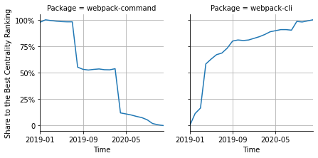

# [`webpack-command`](https://www.npmjs.com/package/webpack-command) -> [`webpack-cli`](https://www.npmjs.com/package/webpack-cli)

The following figure compares the over time centrality ranking of [`webpack-command`](https://www.npmjs.com/package/webpack-command) and [`webpack-cli`](https://www.npmjs.com/package/webpack-cli).

## A pull request example

The following is an example of a pull request that perform a dependency migration from [`webpack-command`](https://www.npmjs.com/package/webpack-command) to [`webpack-cli`](https://www.npmjs.com/package/webpack-cli):

- [aws/jsii#343](https://github.com/aws/jsii/pull/343)

## What is package centrality?

By definition, centrality is a measure of the prominence or importance of a node in a social network.
In our context, the centrality allows us to rank the packages based on the popularity/importance of packages that depend on them.
Specifically, we use the PageRank algorithm to evaluate the shift in their centrality over time.
For more details read our research paper: [Towards Using Package Centrality Trend to Identify Packages in Decline](https://arxiv.org/abs/2107.10168).
