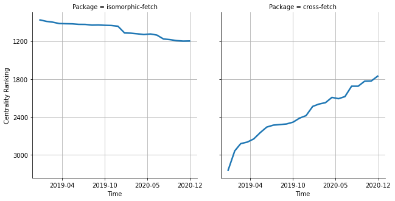

# `isomorphic-fetch` -> `cross-fetch`

The following figure compares the centrality ranking of the package `isomorphic-fetch` to the centrality ranking of the package `cross-fetch` over time.

## Examples of pull requests

The following are examples of pull requests that perform a dependency migration from the package `isomorphic-fetch` to the package `cross-fetch`:

- [apollographql/apollo-fetch#71](https://github.com/apollographql/apollo-fetch/pull/71)
- [Soluto/tweek-clients#76](https://github.com/Soluto/tweek-clients/pull/76)
- [thorgate/tg-resources#38](https://github.com/thorgate/tg-resources/pull/38)
- [cube-js/cube.js#92](https://github.com/cube-js/cube.js/pull/92)
- [callemall/material-ui#19644](https://github.com/callemall/material-ui/pull/19644)
- [facebook/fbjs#385](https://github.com/facebook/fbjs/pull/385)

## What is package centrality?

By definition, centrality is a measure of the prominence or importance of a node in a social network.
In our context, the centrality allows us to rank the packages based on the popularity/importance of packages that depend on them.
Specifically, we use the PageRank algorithm to evaluate the shift in their centrality over time.
For more details read our research paper: [Towards Using Package Centrality Trend to Identify Packages in Decline](https://arxiv.org/abs/2107.10168).
